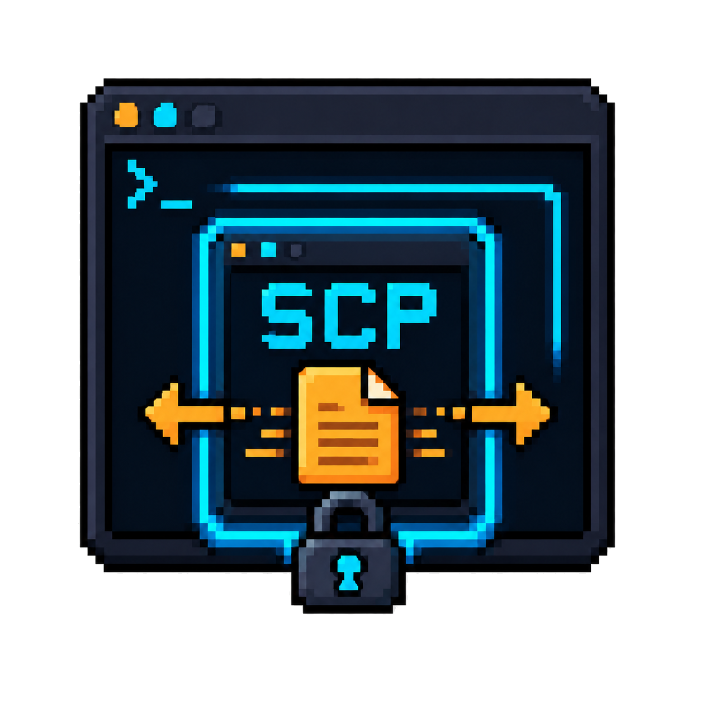

<p align="center">
  
</p>

# SCP Explorer (herdr plugin)

> A MobaXterm-style SCP file explorer for the SSH session in your current herdr
> pane. Browse the remote filesystem in a split pane, then `c` to download or
> `p` to upload — all over your existing SSH connection.

## Changelog

### 1.1.0

- Fix macOS curses mouse-click detection and clicks after scrolling.
- Fix directory downloads and password-authenticated directory transfers.
- Fix password-authenticated SSH command construction and uploads using `pv`.
- Resolve remote `~` paths before transfers and preserve directory-listing errors.
- Bound file previews to 256 KiB and add regression coverage for transfer paths.

## Features

- **Zero-config SSH reuse** — uses the SSH session already open in your pane
  (multiplexed, so no re-auth and instant reconnects).
- **Mouse + keyboard** — click to select, second click to open, scroll wheel to
  move/scroll the listing (auto-scrolls the viewport on long directories, in
  both the SCP window and the local file picker).
- **Cross-platform mouse wheel** — resolves curses button bits for macOS stock
  curses, standard ncurses, and PDCurses (Windows); learns an unknown scroll-down
  bit on first use.
- **Transfers with progress** — `c` (get) / `p` (push) show a real progress bar
  (single files via `pv`, directories via `scp -r` with a smooth ramp).
- **Follow mode** — when opened from an SSH pane, it tracks that pane's `cd`.
- **Directory sizes (async)** — file and directory sizes are shown right-aligned
  in each row; directories are measured in the background (batched `du -sk`)
  so the listing appears instantly and sizes fill in as they resolve. A
  `Total:` line at the bottom accumulates the visible sizes.
- **Bulk select** — press `Space` to mark multiple entries, then `c` to download
  them all at once into a single destination directory.

## Installing

### From the herdr plugin library (recommended)

```bash
herdr plugin install <owner>/scp-explorer --yes
herdr plugin list            # confirm "scp-explorer" is active
```

Then reload config and bind the key (the manifest already declares
`prefix+f`; for a running session also add to `~/.config/herdr/config.toml`):

```toml
[[keys.command]]
key = "prefix+f"
command = "scp-explorer.open"
description = "open SCP file explorer for the SSH session in this pane"
```

```bash
herdr config check && herdr server reload-config
```

### Manual install (any platform)

```bash
git clone <repo-url> ~/.config/herdr/plugins/github/scp-explorer
herdr plugin install scp-explorer --yes   # or restart herdr
```

### Requirements

| Need            | macOS                 | Linux                   | Windows                          |
|-----------------|-----------------------|-------------------------|----------------------------------|
| Python          | `python3` (Xcode CLT) | `python3`               | `python3` on PATH **or** `py -3`|
| SSH             | built-in              | built-in / `openssh`    | OpenSSH (bundled w/ Git)         |
| Password auth   | `sshpass` (`brew`)    | `sshpass` (apt/dnf)     | not required if using keys       |

> **Windows note:** the pane `command` is `python3 src/explorer.py`. Make sure
> Python is on your PATH as `python3`; if your install only provides `py`,
> either add `python3` as an alias or edit `herdr-plugin.toml` to
> `["py", "-3", "src/explorer.py"]`. A real terminal (Windows Terminal / ConPTY)
> is required for the curses TUI and mouse support.

## Usage

1. Focus an SSH pane in herdr.
2. Press `prefix+f` (or run the `scp-explorer.open` action).
3. A split pane opens with the remote file explorer.

```
Up/Down / PgUp / PgDn .... move selection (viewport auto-scrolls)
Enter / Right ............ open directory or view file
Left / h ................. go up one directory
g ........................ go to ~
/ ........................ jump to an absolute remote path
f ........................ toggle follow-mode (track the SSH pane's cd)
space .................... mark/unmark current entry (enters bulk mode)
c ........................ get file/dir from remote -> local picker
                             (in bulk mode) download all marked entries
p ........................ push local file -> remote (local picker)
r ........................ refresh
P ........................ set/change SSH password (stored in memory only)
q / Esc .................. close
Mouse: click selects, 2nd click opens; wheel scrolls
```

### Bulk select (download multiple files at once)

1. Navigate to an entry and press `Space` to mark it — this automatically
   switches the explorer into bulk mode (the header shows `BULK:n`).
2. Navigate with Up/Down and press `Space` again to toggle marks on/off
   for each entry (marked entries show a `*` icon and bold highlight).
3. Keep marking as many entries as you like.
4. Press `c` to download **all marked entries** — you'll be prompted for a
   destination directory, then each file/dir transfers in turn with a shared
   progress bar.
5. Press `Esc` to cancel and exit bulk mode. Unmarking the last entry with
   `Space` also exits bulk mode automatically.

### Local file picker (used by c / p)

```
A navigable browser of your LOCAL machine:
- Up/Down / PgUp / PgDn ... move
- Enter ................... open a directory (or choose a file in 'file' mode)
- Tab (dir mode) .......... confirm the current directory as the target
- g ....................... go to ~
- / ....................... jump to an absolute local path
- Esc / q ................. cancel
- Mouse: click selects a row; a second click on the same row activates it
  (opens a directory, or chooses a file in 'file' mode). In 'dir'
  mode you can also click the header line to confirm the current
  directory. Wheel up/down moves the selection and scrolls.
```

### Follow mode (auto-follow the SSH pane's CWD)

When the explorer is opened from an SSH pane, it follows that pane's remote
working directory: if you `cd` in the terminal, the explorer jumps to match.
Only changes made in the *SSH pane* are followed — navigating inside the
explorer never gets reverted by follow.

## Troubleshooting

- The explorer writes a diagnostic log to `$HERDR_PLUGIN_STATE_DIR/scp-explorer.log`
  (or `~/.config/herdr/plugins/state/scp-explorer/scp-explorer.log` when run
  outside Herdr) on every run (detected target, first listing result). If
  something looks wrong, open a normal pane and check that file. You can also
  enable mouse-event debugging with `HERDR_SCP_MOUSE_DEBUG=1` before opening the
  explorer, which appends raw button states to `scp-explorer-mouse.log`.
- "Connecting to <host> ..." shows while the first SSH handshake is in flight;
  the first connect can take a few seconds, later ones are instant (multiplex).
- Requires SSH key OR password auth to the remote. Password auth needs sshpass
  (brew install hudochenkov/sshpass/sshpass).

### Transfer progress bar

When you press `c` (get) or `p` (push), a progress bar is drawn on the bottom
line of the explorer pane for the duration of the transfer:

    [#####-----] 50%  2.3M/s  eta 4s  get foo.iso

- **Single files**: transferred by streaming `ssh ... cat` through `pv` (if
  `pv` is installed: `brew install pv`). `pv` reports exact bytes, so the bar
  shows a true percentage, a live transfer rate, and an ETA. If `pv` is absent,
  the remote file size is probed with `stat` so the bar still shows a real %.
- **Directories** (`c`/`p` on a folder): copied with `scp -r` and shown with an
  indeterminate animated bar plus a live speed estimate (the total size is
  probed via `du`/`os.walk`). scp itself is silent, so the % is a smooth ramp.
- The bar auto-abbreviates to fit narrow panes and reverts to the normal status
  line once the transfer finishes (showing `got ...` / `pushed ...` or an error).

## License

MIT — see [LICENSE](LICENSE).
